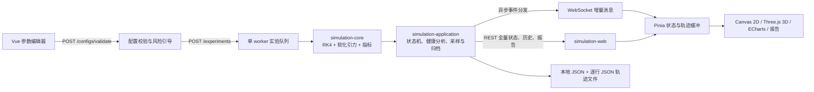

# Three Body Lab / 三体参数实验室

Three Body Lab 是一个面向本地实验的 **N 体引力数值模拟、实时计算与交互式可视化全栈平台**。用户可以编辑天体质量、三维位置与速度、时间步长、软化长度和结束条件，将配置提交到顺序实验队列，并通过 WebSocket 观察模拟状态、轨迹、守恒量、近距离事件与数值健康诊断。

项目以纯 Java 物理核心为基础，后端由 Spring Boot 提供实验编排、文件持久化、REST API 和原生 WebSocket；前端使用 Vue 3、Canvas 2D、Three.js 与 ECharts 完成参数实验、二维/三维观察、历史回放和报告展示。生产构建会把前端静态资源打入单个可执行 JAR，不依赖数据库、缓存或消息队列。

## 界面预览

### 实时模拟与诊断


### 实验报告


## 核心功能

- **N 体参数实验**：支持 2–20 个天体，编辑质量、颜色、三维初始位置/速度、时间步长、引力常数、Plummer 软化长度、最大步数与目标模拟时间。
- **结构化配置校验**：后端返回错误、风险级别、预计积分步数、覆盖时间、限制结束条件、初始最近天体对，以及可解释的调整建议；前端提供自动校验和风险确认。
- **顺序实验队列**：单 worker 依次运行实验，支持排队顺序调整、暂停、继续、单步、取消、删除，以及兼容 API 中的重启操作。
- **实时监控**：WebSocket 增量推送快照、轨迹、物理指标、数值健康、状态、近距离事件、诊断和错误消息。
- **2D / 3D 可视化**：Canvas 2D 提供 XY / XZ / YZ 投影、缩放、平移、跟随和自适应视图；Three.js 提供空间轨迹、自由轨道相机与 XY / XZ / YZ 相机预设。
- **历史回看与精确回放**：按步数范围读取归档轨迹，在前端时间轴回看；采样点不能精确命中时，可提交后端回放任务重算目标步。
- **数值健康与现象解释**：跟踪能量和角动量漂移、近距离事件与数值异常，生成 GOOD / WARNING / POOR / FAILED 健康报告、诊断证据和对照实验建议。
- **报告与导出**：报告页展示配置、指标、事件、轨迹采样与对照实验来源；支持报告数据下载、浏览器打印/PDF、配置 JSON 和轨迹 CSV 导出。
- **离线前端模式**：MSW mock 实现预设、配置校验、实验状态、调度和 WebSocket 流程，便于不启动 Java 后端时开发前端。
- **Swing 兼容界面**：保留独立的旧版 Swing 适配器，物理计算仍委托给 `simulation-core`。

## 当前模拟能力

### 数值模型

| 能力 | 当前实现 |
| --- | --- |
| 空间维度 | 三维位置与速度 |
| 天体数量 | 2–20 |
| 积分方法 | 固定时间步长的四阶 Runge-Kutta（RK4） |
| 引力模型 | 牛顿万有引力，成对计算加速度 |
| 近距离处理 | Plummer 软化：`(‖r‖² + ε²)^(-3/2)` |
| 结束条件 | `maxSteps`、`targetSimulationTimeSeconds`，两者同时存在时先到者生效 |
| 近距离事件 | 两体距离小于 `5 × softeningLengthMeters` |
| 数值防护 | 配置边界校验、有限值检查、非有限状态/指标失败诊断 |
| 单位 | 核心、REST 与 WebSocket 全部使用 SI：kg、m、m/s、s、J |

每次指标采样会计算动能、软化势能、总能量、相对能量漂移、总角动量、总线动量、当前最近两体距离及对应天体。应用层在此基础上维护峰值、趋势、历史最近距离、近距离次数和数值健康建议。

### 内置预设

当前 `simulation-core` 提供 A–J 十组预设：

| 预设 | 场景 |
| --- | --- |
| A | 稳定层级三星与行星系统 |
| B | 等质量双星与外围轻质量行星 |
| C | 等质量三体拉格朗日等边三角构型 |
| D | 20 天体层级双星压力测试 |
| E | 基于 J2000 状态量的太阳与八大行星三维系统 |
| F | 地月稳定双体轨道 |
| G | 分别位于 XY 与 XZ 平面的正交双轨道系统 |
| H | 轨道伴星与高速穿越天体组成的三维系统 |
| I | 非共面三体混沌近遇 |
| J | XY / XZ / YZ 三平面正交轨道四体系统 |

预设是可编辑的初始配置，不代表对长期物理稳定性的普遍保证。

## 可视化与交互

### Canvas 2D

- XY、XZ、YZ 三种投影平面；
- 滚轮缩放、拖拽平移、双击/按钮适应窗口；
- 自由观察、质心跟随、指定天体跟随和自动适应；
- 网格、标签、轨迹、悬停信息与性能 HUD；
- 每个天体最多保留 8,000 个实时轨迹点，并使用轨迹抽稀、缓存与自适应渲染质量控制绘制成本。

### Three.js 3D

- WebGL 球体、辉光外观、空间轨迹与参考网格；
- OrbitControls 自由观察；
- FREE、XY、XZ、YZ 相机预设；
- 透视/正交相机框架、动态包围盒适配和设备像素比控制；
- 与 2D 视图共用同一份实时状态、轨迹缓存和历史游标。

### 指标与报告

ECharts 用于指标趋势展示；实验页还包含 KPI、事件时间线、数值健康卡片、现象总览和历史播放控制。报告页复用实验数据与采样说明，并通过浏览器打印能力生成 PDF。

## 架构与数据流



前端把 REST 结果视为权威全量状态，WebSocket 只负责实时增量。断线或重新进入实验时先通过 REST 同步，再依据单调递增的 `sequence` 处理后续消息。

模块依赖保持单向：

```text
simulation-launcher -> simulation-web -> simulation-application -> simulation-core
simulation-launcher -> simulation-swing -> simulation-core
```

## 技术栈

版本取自当前 `pom.xml` 与 `frontend/package.json`：

| 范围 | 技术 |
| --- | --- |
| 后端语言与构建 | Java 17、Maven 多模块 |
| Web | Spring Boot 4.0.7、Spring Web MVC、原生 WebSocket、Bean Validation |
| 物理与应用层 | 纯 Java RK4、Jackson、本地文件持久化 |
| 前端 | Vue `^3.5.13`、TypeScript `~5.7.2`、Vite `^6.0.5` |
| 状态与路由 | Pinia `^4.0.2`、Vue Router `^4.5.0` |
| 可视化 | Canvas 2D、Three.js `^0.185.1`、ECharts `^6.1.0` |
| 前端测试 | Vitest `^4.1.10`、jsdom `^29.1.1`、Playwright `^1.62.1` |
| Mock 与契约生成 | MSW `^2.15.0`、openapi-typescript、json-schema-to-typescript |
| 后端测试 | JUnit 5.11.4、Spring Boot Test |

## 项目结构

```text
ThreeBody/
├── contracts/                 OpenAPI、WebSocket Schema 与协议示例
├── frontend/                  Vue 3 前端、MSW mock、Vitest 与 Playwright
│   ├── src/components/        2D/3D 场景、参数、队列、指标、健康与回放组件
│   ├── src/contracts/         业务代码使用的契约类型门面
│   ├── src/generated/         由契约生成的 TypeScript 类型
│   ├── src/mocks/             浏览器内 mock 运行时
│   ├── src/stores/            Pinia 草稿、实验与偏好状态
│   ├── src/views/             实验室、实验详情、报告与 404 页面
│   └── e2e/                   Playwright 用户流程
├── simulation-core/           领域模型、配置校验、预设、RK4 与物理指标
├── simulation-application/    实验队列、状态机、诊断、回放与文件仓库
├── simulation-web/            REST、WebSocket、DTO 与 Spring 配置
├── simulation-swing/          旧 Swing UI 适配器
├── simulation-launcher/       Spring Boot 入口与最终可执行 JAR 打包
├── docs/                      交接记录和前后端计划
└── pom.xml                    Maven 父工程
```

`contracts/openapi.yaml` 与 `contracts/ws-events.schema.json` 是前后端共享协议的事实来源。前端业务代码通过 `frontend/src/contracts/index.ts` 导入类型，不直接依赖手写协议定义。

## 本地开发

### 环境要求

- **JDK 17**：父 POM 明确设置 `maven.compiler.release=17`。
- **Maven**：用于多模块构建；仓库没有 Maven Wrapper，也没有声明最低 Maven 版本。
- **Node.js 与 npm**：用于前端开发和包含前端的完整打包；仓库提供 lockfile v3，但没有通过 `engines`、`.nvmrc` 等文件声明最低 Node.js/npm 版本。
- 支持 WebGL 的现代浏览器：使用 3D 场景时需要。

仅运行已经构建好的 JAR 时不需要 Maven、Node.js、数据库或其他外部服务。

### 启动后端与集成应用

从仓库根目录运行：

```bash
mvn -pl simulation-launcher -am spring-boot:run
```

默认服务地址是 <http://127.0.0.1:8721>。应用就绪后会尝试调用系统默认浏览器；在无桌面环境或系统不支持 `Desktop.BROWSE` 时，需要手动打开该地址。

### 启动前端

先启动 Java 后端，然后执行：

```bash
cd frontend
npm ci
npm run dev
```

Vite 默认监听 `http://localhost:5173`，并将 `/api` 与 `/ws` 代理到 `127.0.0.1:8721`。

### 前端 Mock 模式

PowerShell：

```powershell
cd frontend
$env:VITE_API_MODE = 'mock'
npm run dev
```

Bash：

```bash
cd frontend
VITE_API_MODE=mock npm run dev
```

`VITE_API_MODE` 未设置时默认为 `live`。Mock 模式适合前端开发与 E2E，不应被视为 Java 后端持久化和并发语义的替代实现。

### Docker 启动

仓库提供单容器 Docker 方案：Vue 静态资源、REST API 和 WebSocket 一起运行在 Spring Boot 应用中，不需要 Nginx、数据库或其他外部服务。需要预先安装 Docker Engine 或 Docker Desktop，并使用 Docker Compose V2。

从仓库根目录构建并启动：

```bash
docker compose up -d --build
```

启动后访问 <http://127.0.0.1:8721>。Compose 仅将端口绑定到宿主机回环地址；容器内部通过 `SERVER_ADDRESS=0.0.0.0` 监听。REST 与 WebSocket 继续使用同源的 `/api/v1` 和 `/ws/v1`，无需额外配置前端地址。

查看状态和日志：

```bash
docker compose ps
docker compose logs -f app
```

停止容器但保留实验数据：

```bash
docker compose down
```

实验数据保存在 Compose named volume `threebody-data` 中，重新创建容器后仍会恢复。只有明确需要删除全部容器数据时才使用 `docker compose down -v`。

## 构建与验证

### 完整构建

```bash
mvn clean verify
```

构建到 `simulation-launcher` 时会在 `generate-resources` 阶段执行 `npm ci` 和 `npm run build`，随后把 `frontend/dist/` 复制到 `classpath:/static/`，并由 Spring Boot repackage 生成：
生成产物：
```text
simulation-launcher/target/three-body-lab.jar
```

运行产物：

```bash
java -jar simulation-launcher/target/three-body-lab.jar
```

### 按模块test

```bash
mvn -pl simulation-core -am test
mvn -pl simulation-application -am test
mvn -pl simulation-web -am test
```

### 前端test

在 `frontend/` 目录运行：

```bash
npm test
npm run build
npm run test:e2e
npm run verify
```

`npm run verify` 依次生成契约类型、执行 TypeScript 检查、Vitest、生产构建和 Playwright。项目当前没有独立 lint 脚本。

修改 `contracts/` 后重新生成前端类型：

```bash
cd frontend
npm run generate:contracts
```

不要手工编辑 `frontend/src/generated/`。

## 配置与本地数据

### 服务与开发代理

| 配置 | 当前值 | 来源 |
| --- | --- | --- |
| 后端监听地址 | `127.0.0.1` | `simulation-launcher/src/main/resources/application.yml` |
| 后端端口 | `8721` | 同上 |
| Vite 开发端口 | `5173` | `frontend/vite.config.ts` |
| REST 代理 | `/api` → `http://127.0.0.1:8721` | `frontend/vite.config.ts` |
| WebSocket 代理 | `/ws` → `ws://127.0.0.1:8721` | `frontend/vite.config.ts` |
| 前端数据源 | `VITE_API_MODE=live|mock`，默认 `live` | `frontend/src/main.ts` |

本地直接运行 JAR 时后端只绑定本机回环地址。Docker Compose 同样只向宿主机 `127.0.0.1:8721` 发布端口，但会通过环境变量让服务在容器内部监听 `0.0.0.0:8721`。仓库没有反向代理或远程部署配置。

### 数据目录

文件仓库按以下规则选择目录：

| 环境 | 目录 |
| --- | --- |
| Windows 且存在 `LOCALAPPDATA` | `%LOCALAPPDATA%\ThreeBodyLab` |
| 其他情况 | `${user.home}/.threebody-lab` |
| Docker Compose | named volume `threebody-data` → `/home/threebody/.threebody-lab` |

当前文件布局：

```text
<data-dir>/
├── experiments.json                 实验清单与元数据
├── trajectory-<experiment-id>.json  逐行写入的 JSON 轨迹归档
└── .corrupted/                      损坏 experiments.json 的隔离目录
```

实验清单通过临时文件和原子替换写入；轨迹由后台归档线程批量追加，避免在积分热路径同步执行磁盘序列化。删除实验会同时删除对应轨迹文件。

## 基本使用流程

1. 从 A–J 预设选择起点，或手动编辑 2–20 个天体的 SI 参数。
2. 查看服务端配置摘要、风险证据和建议；必要时应用建议或确认风险。
3. 创建实验。实验进入单 worker 队列并按顺序运行。
4. 在 2D 或 3D 场景中观察状态、轨迹、KPI、趋势、事件与数值健康。
5. 暂停后单步检查，或使用历史时间轴定位近距离/诊断事件；需要时请求精确回放。
6. 对 WARNING / POOR / FAILED 结果创建带来源关系的对照实验，比较时间步长调整前后的健康状态。
7. 在报告页检查采样说明和来源差异，并导出配置、轨迹或报告数据。

## REST API 与 WebSocket

OpenAPI 版本为 **1.1.0**，REST 基础地址为 `http://127.0.0.1:8721/api/v1`。完整定义见 [`contracts/openapi.yaml`](contracts/openapi.yaml)。

| 范围 | 方法与路径 | 用途 |
| --- | --- | --- |
| 预设 | `GET /presets` | 获取 A–J 内置预设 |
| 校验 | `POST /configs/validate` | 获取校验结果、配置摘要与风险引导 |
| 实验 | `GET/POST /experiments` | 列表与创建 |
| 实验 | `GET/PUT/DELETE /experiments/{id}` | 详情、编辑排队配置、删除 |
| 控制 | `POST /experiments/{id}/actions` | PAUSE / RESUME / STEP / RESTART / CANCEL |
| 队列 | `PATCH /queue` | 提交完整实验 ID 顺序 |
| 导出 | `GET /experiments/{id}/exports/config` | 配置 JSON |
| 导出 | `GET /experiments/{id}/exports/trajectory` | 分层采样轨迹 CSV |
| 报告 | `GET /experiments/{id}/report-data` | 报告聚合数据 |
| 历史 | `GET /experiments/{id}/history` | 按步数范围读取归档切片 |
| 回放 | `POST /experiments/{id}/replay-jobs` | 创建精确回放任务 |
| 回放 | `GET/DELETE /experiments/{id}/replay-jobs/{jobId}` | 查询或取消回放任务 |

WebSocket 地址：

```text
ws://127.0.0.1:8721/ws/v1/experiments/{id}
```

消息契约版本为 **1.1**，完整 Schema 见 [`contracts/ws-events.schema.json`](contracts/ws-events.schema.json)。

| 消息 | 发布方式 | 内容 |
| --- | --- | --- |
| `SNAPSHOT` | 最高 60 Hz | 当前步、模拟时间、位置和速度 |
| `TRAJECTORY` | 最高 60 Hz | 轨迹增量与采样步长 |
| `METRICS` | 最高 2 Hz | 能量、动量、最近距离和运行速率 |
| `HEALTH` | 健康状态更新 | 权威数值健康报告 |
| `STATUS` | 状态变化 | 状态、进度、结束原因和队列位置 |
| `NEAR_ENCOUNTER` | 事件驱动 | 近距离事件生命周期与证据 |
| `DIAGNOSTIC` | 事件驱动 | 漂移、逃逸、偏转、解体或数值不稳定诊断 |
| `ERROR` | 错误发生时 | 非有限状态、非有限指标等错误 |

每个消息信封包含 `schemaVersion`、`experimentId`、单调递增的 `sequence`、时间戳和 payload。

## 性能与稳定性设计

- **确定的并发模型**：实验由单 worker 顺序计算，同一时刻至多一个 RUNNING 实验，避免多个实验争用和状态转换竞态。
- **计算与推送解耦**：应用层异步分发事件；每个 WebSocket 会话拥有容量受限的发送 mailbox，慢客户端不会阻塞积分线程。
- **按语义处理背压**：高频快照类消息优先保留最新值，状态、近距离、诊断和错误消息保持可靠有序语义。
- **墙钟发布上限**：快照与轨迹最高 60 Hz、指标最高 2 Hz，发布频率与模拟 steps/s 分离。
- **有界内存与归档**：每体实时窗口上限 8,000 点；归档目标上限 50,000 个状态，超过后采用分层采样；事件列表上限 1,000 条。
- **后台批量写入**：轨迹归档按批次或时间间隔刷新，磁盘压缩和序列化不进入物理步进热路径。
- **恢复与隔离**：服务启动加载实验清单；损坏清单移入 `.corrupted/`，避免阻断其他数据初始化。
- **前端渲染控制**：快照插值、轨迹缓冲、抽稀、分层 Canvas、可见性检测、动态 DPR 与 3D 资源释放共同限制实时渲染成本。

## 当前状态与 Roadmap

当前代码已经覆盖“参数校验 → 排队计算 → 实时传输 → 2D/3D 观察 → 健康诊断 → 历史回放 → 报告/导出 → 对照实验”的本地闭环，REST/OpenAPI 与 WebSocket Schema 已演进到 1.1 系列。项目仍以本地单用户实验室为定位，没有数据库、用户系统或远程部署层。

以下后续项仅摘自仓库现有进度/交接文档：

- 补充真实前后端联调中的 WebSocket 乱序、断线重连、恢复和失败任务验证；
- 完善 Canvas/WebGL 单测环境，并修正依赖固定画布命中的 tooltip E2E 用例；
- 增加专门的 Health / 创建对照实验 E2E，覆盖新实验 ID、来源保留和建议步长预填；
- 若后续引入 Compare 页面，复用现有 `healthStatus`、完整健康报告和对照实验来源数据。

这些条目是已记录的后续方向，不表示已经实现或承诺具体发布时间。

## License

仓库当前没有 `LICENSE` 或 `COPYING` 文件，也未在构建配置中声明项目许可证。使用、修改或分发前请先向项目维护者确认授权范围。
