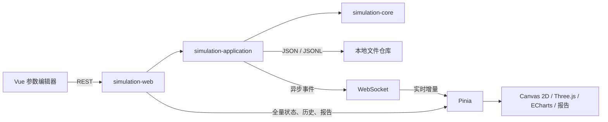

# Three Body Lab / 三体参数实验室

Three Body Lab 是一个面向参数实验的 N 体引力模拟平台。它把配置校验、顺序计算、实时可视化、数值健康诊断、历史回放、报告和文件持久化集成在一个可执行 JAR 中，不依赖数据库、缓存或消息队列。

后端使用 Java 17、Spring Boot 4 和固定步长 RK4；前端使用 Vue 3、Canvas 2D、Three.js、ECharts 与 Pinia。生产构建会将前端静态资源打入 Spring Boot JAR，通过同一来源提供页面、REST API 和 WebSocket。

## 在线部署

- 公网地址：[http://39.108.101.149:8721/](http://39.108.101.149:8721/)
- 部署方式：NGINX `8721` 对外提供页面、REST 与 WebSocket，Java 服务仅监听服务器回环地址 `127.0.0.1:18721`。
- 部署复盘：[`docs/PUBLIC_DEPLOYMENT_POSTMORTEM.md`](docs/PUBLIC_DEPLOYMENT_POSTMORTEM.md)

> 当前公网实例仅用于项目展示和验收，不承诺长期可用。应用尚未提供用户认证，请勿上传敏感数据、执行破坏性操作或依赖其中的实验数据长期保存。

## 界面预览


## 核心能力

- 支持 2–20 个天体的质量、颜色、三维初始位置和速度配置。
- 使用牛顿万有引力、Plummer 软化和固定时间步长 RK4 积分。
- 提供 A–J 十组可编辑预设，以及服务端归一化、校验、风险分析和运行量预估。
- 单 worker 顺序执行实验，支持调序、暂停、继续、单步、取消、重启和删除。
- WebSocket 增量推送状态、快照、轨迹、指标、健康报告、近距离事件和错误。
- Canvas 2D 支持 XY/XZ/YZ 投影、缩放、平移、跟随与自动适应。
- Three.js 3D 支持空间轨迹、自由相机和 XY/XZ/YZ 相机预设。
- 历史时间轴支持双向拖动、近似预览和松手后的精确回放解析。
- 报告页提供数值健康、事件、采样说明、配置 JSON、轨迹 CSV 和打印/PDF。
- MSW Mock 模式可在不启动 Java 服务时运行主要前端流程。

核心、REST 与 WebSocket 中的物理量全部使用 SI 单位：kg、m、m/s、s、J。

## 当前重要行为

### 同参数实验去重

`POST /api/v1/experiments` 会在服务端归一化和校验配置后执行原子查重：

- 忽略顶层实验名称和天体 ID；
- 保留天体顺序、名称、颜色、质量、位置、速度及全部模拟参数；
- 任意实际参数不同都会创建新实验；
- 并发提交相同配置只会产生一条记录。

匹配多条记录时优先复用运行中、排队或暂停的记录，其次是最近完成的记录，最后是最近取消或失败的记录。新建返回 `201 Created`，复用返回 `200 OK`；两种响应使用相同的 `Experiment` 结构和 `Location` 头。

去重只阻止新重复记录，不会追溯删除历史数据。

### 同 ID 重启

`PAUSED`、`COMPLETED`、`CANCELLED` 和 `FAILED` 实验可以重启。重启会保持实验 ID，清空旧状态、轨迹、报告和回放任务，并使用原配置或请求中的新配置重新入队。前端继续通过同一实验的 WebSocket 地址接收新一轮消息。

旧结果不可恢复，因此界面会在提交 `RESTART` 前要求确认。

### 历史时间轴

拖动期间只使用前端缓存做显示插值，不启动精确重算或高频网络请求；释放指针后才解析最终目标步。插值会从 exact、focus、live 和 overview 四层缓存中选择全局最近的前后帧，避免较远旧帧造成天体瞬移。

## 架构



模块依赖保持单向：

```text
simulation-launcher -> simulation-web -> simulation-application -> simulation-core
simulation-launcher -> simulation-swing -> simulation-core
```

`contracts/openapi.yaml` 和 `contracts/ws-events.schema.json` 是前后端共享契约的事实来源。

## 项目结构

```text
ThreeBody/
├── contracts/                  OpenAPI 与 WebSocket JSON Schema
├── deploy/nginx/               正式 NGINX 配置
├── deploy/systemd/             Linux systemd 配置
├── docs/                       计划、复盘和交接文档
├── frontend/                   Vue 3、MSW、Vitest 与 Playwright
├── scripts/                    本地辅助脚本
├── simulation-core/            物理、预设、校验与指标
├── simulation-application/     队列、状态、诊断、回放与持久化
├── simulation-web/             REST 与 WebSocket
├── simulation-swing/           旧 Swing 适配器
├── simulation-launcher/        Spring Boot 入口与最终 JAR
├── docker-compose.yml
└── pom.xml
```

## 环境要求

- JDK 17；
- Maven；
- Node.js 与 npm，用于前端开发和完整打包；
- 使用 3D 场景时需要支持 WebGL 的现代浏览器；
- Docker 运行方式需要 Docker Engine/Desktop 与 Compose V2。

仓库没有 Maven Wrapper，也没有通过 `.nvmrc` 或 `engines` 固定 Node.js 版本。安装前端依赖时应使用 lockfile 和 `npm ci`。

## 快速开始

### 集成应用

```bash
mvn -pl simulation-launcher -am spring-boot:run
```

打开 <http://127.0.0.1:8721>。

打包并运行：

```bash
mvn clean verify
java -jar simulation-launcher/target/three-body-lab.jar
```

默认服务配置：

```yaml
server:
  address: 127.0.0.1
  port: 8721
```

### 前端开发

先启动 Java 后端，再执行：

```bash
cd frontend
npm ci
npm run dev
```

Vite 默认监听 `http://localhost:5173`，并把 `/api` 和 `/ws` 代理到 `127.0.0.1:8721`。

Mock 模式：

```powershell
cd frontend
$env:VITE_API_MODE = 'mock'
npm run dev
```

```bash
cd frontend
VITE_API_MODE=mock npm run dev
```

`VITE_API_MODE` 默认是 `live`。Mock 模式会模拟去重、同 ID 重启、调度、回放和 WebSocket，但不能代替真实后端的持久化与并发验证。

## Docker

```bash
docker compose up -d --build
docker compose ps
docker compose logs -f app
```

访问 <http://127.0.0.1:8721>。实验数据保存在 named volume `threebody-data` 中。

```bash
# 停止但保留数据
docker compose down

# 确认需要清空全部 Docker 实验数据时才使用
docker compose down -v
```

## 构建与验证

完整构建：

```bash
mvn clean verify
```

按模块测试：

```bash
mvn -pl simulation-core -am test
mvn -pl simulation-application -am test
mvn -pl simulation-web -am test
```

前端验证：

```bash
cd frontend
npm test
npm run build
npm run test:e2e
npm run verify
```

`npm run verify` 会依次生成契约类型、执行 TypeScript 检查、Vitest、生产构建和 Playwright。项目当前没有独立 lint 脚本。

修改契约后运行：

```bash
cd frontend
npm run generate:contracts
```

不要手工编辑 `frontend/src/generated/`。

## REST API 与 WebSocket

REST 基础路径为 `/api/v1`，常用接口如下：

| 方法与路径 | 用途 |
| --- | --- |
| `GET /presets` | 获取 A–J 内置预设 |
| `POST /configs/validate` | 归一化、校验并返回风险摘要 |
| `GET /experiments` | 查询实验列表 |
| `POST /experiments` | 创建或复用同参数实验 |
| `GET/PUT/DELETE /experiments/{id}` | 详情、更新排队配置、删除 |
| `POST /experiments/{id}/actions` | PAUSE / RESUME / STEP / RESTART / CANCEL |
| `PATCH /queue` | 调整完整队列顺序 |
| `GET /experiments/{id}/history` | 查询历史轨迹切片 |
| `POST /experiments/{id}/replay-jobs` | 创建精确回放任务 |
| `GET /experiments/{id}/report-data` | 获取报告聚合数据 |
| `GET /experiments/{id}/exports/config` | 导出配置 JSON |
| `GET /experiments/{id}/exports/trajectory` | 导出轨迹 CSV |

完整定义见 [`contracts/openapi.yaml`](contracts/openapi.yaml)，当前文档版本为 `1.1.0`。

WebSocket 地址：

```text
/ws/v1/experiments/{experimentId}
```

消息 Schema 版本为 `1.1`，主要类型包括 `SNAPSHOT`、`TRAJECTORY`、`METRICS`、`HEALTH`、`STATUS`、`NEAR_ENCOUNTER`、`DIAGNOSTIC` 和 `ERROR`。每条消息都包含 `schemaVersion`、`experimentId`、单调递增的 `sequence`、时间戳和 payload。

完整定义见 [`contracts/ws-events.schema.json`](contracts/ws-events.schema.json)。

## 文件持久化

项目不使用数据库。默认数据目录：

| 环境 | 目录 |
| --- | --- |
| Windows | `%LOCALAPPDATA%\ThreeBodyLab` |
| 其他本地环境 | `${user.home}/.threebody-lab` |
| Docker Compose | `/home/threebody/.threebody-lab` |
| 仓库 systemd 配置 | `/var/lib/three-body-lab/.threebody-lab` |

```text
<data-dir>/
├── experiments.json
├── trajectory-<experiment-id>.json
└── .corrupted/
```

实验清单通过临时文件和原子替换写入；轨迹由后台线程批量追加，避免在积分热路径同步写盘。损坏清单会被移动到 `.corrupted/`，删除实验会同时清理对应轨迹。

## Linux 服务器部署

仓库配置采用以下拓扑：

- Java 监听 `127.0.0.1:18721`；
- NGINX 对外监听 `8721`；
- systemd 以 `threebody` 用户运行；
- JAR 位于 `/opt/three-body-lab/three-body-lab.jar`；
- Java 用户目录位于 `/var/lib/three-body-lab`。

### 安装

```bash
mvn clean verify

sudo useradd --system --home /var/lib/three-body-lab --shell /usr/sbin/nologin threebody
sudo install -d -o root -g root -m 0755 /opt/three-body-lab
sudo install -d -o threebody -g threebody -m 0750 /var/lib/three-body-lab

sudo install -m 0644 simulation-launcher/target/three-body-lab.jar \
  /opt/three-body-lab/three-body-lab.jar
sudo install -m 0644 deploy/systemd/three-body-lab.service \
  /etc/systemd/system/three-body-lab.service
sudo install -m 0644 deploy/nginx/three-body-lab.conf \
  /etc/nginx/conf.d/three-body-lab.conf

sudo systemctl daemon-reload
sudo systemctl enable --now three-body-lab.service
sudo nginx -t
sudo systemctl reload nginx
```

若 `threebody` 用户已经存在，跳过 `useradd`。

### 状态与日志

```bash
systemctl status three-body-lab.service
systemctl show three-body-lab.service -p MainPID -p NRestarts
journalctl -u three-body-lab.service -f
tail -f /var/log/nginx/access.log /var/log/nginx/error.log
```

### 更新与回滚

```bash
sudo install -d -m 0755 /opt/three-body-lab/backups
sudo cp -p /opt/three-body-lab/three-body-lab.jar \
  /opt/three-body-lab/backups/three-body-lab.jar.$(date +%Y%m%d-%H%M%S).bak
sudo install -m 0644 simulation-launcher/target/three-body-lab.jar \
  /opt/three-body-lab/three-body-lab.jar
sudo systemctl restart three-body-lab.service
```

健康检查失败时恢复备份 JAR 并重新启动服务，不要修改或删除数据目录。

## 部署验收

### 页面与 REST

```bash
curl -i http://127.0.0.1:18721/api/v1/experiments
curl -I http://<host>:8721/
curl -I http://<host>:8721/experiments/<experiment-id>
curl -I http://<host>:8721/reports/<experiment-id>
```

实验页和报告页直接访问或刷新都应返回前端页面，不能出现 Spring Whitelabel 404。

### WebSocket 101

```bash
curl --http1.1 -i -N \
  -H 'Connection: Upgrade' \
  -H 'Upgrade: websocket' \
  -H 'Sec-WebSocket-Version: 13' \
  -H 'Sec-WebSocket-Key: dGhlIHNhbXBsZSBub25jZQ==' \
  -H 'Origin: http://<host>:8721' \
  -H 'Host: <host>:8721' \
  http://<host>:8721/ws/v1/experiments/<experiment-id>
```

验收必须同时确认：

- 握手为 `101 Switching Protocols`；
- 真实浏览器 Origin 下不会返回 403；
- 开始或重启实验后能收到 `STATUS` 和 `SNAPSHOT`；
- 子路由刷新、报告、REST 和断线重连正常；
- 相同配置第二次提交返回原 ID，实验数量不增加。

## NGINX 关键点

正式配置位于 `deploy/nginx/three-body-lab.conf`：

- `/api/` 独立代理，不使用 SPA fallback 掩盖真实 API 404；
- `/ws/` 保留 Upgrade、长连接超时和转发请求头；
- `/assets/` 独立代理静态资源；
- 只有页面路由使用 `index.html` fallback；
- 使用 `Host $http_host` 保留非标准端口。

不要把 `$http_host` 改回 `$host`。公网使用 `8721` 等非标准端口时，丢失端口会使 Spring WebSocket 的 Host 与 Origin 不一致并返回 403。

## 常见问题

### 点击开始后一直显示“正在重连”

依次检查 Java 服务状态、`NRestarts`、REST 状态、NGINX 中的 WebSocket 状态码，以及 Host、Origin、Forwarded-Port 和实际业务消息。CPU、内存和带宽正常不能证明 WebSocket 链路正常。

### 刷新实验页出现 Whitelabel 404

这是 Vue History 路由缺少服务器端 fallback。使用仓库 NGINX 配置，并确认 fallback 只作用于页面路由，不作用于 `/api/` 和 `/ws/`。

### 仍然产生重复实验

检查天体顺序、名称、颜色或物理参数是否确实完全相同，并确认服务器运行的是支持 `200` 复用响应的新 JAR。历史重复数据不会自动删除。

### 时间轴拖不动或天体瞬移

确认浏览器加载了最新静态资源，并检查拖动期间是否保持 REVIEW、pointer cancel/capture 丢失是否正常收尾、移动是否按动画帧合并，以及精确回放是否只在松手后发起。

## 安全边界

项目当前没有用户系统和身份认证。将服务暴露到公网意味着访问者可以创建、重启、取消和删除实验。正式部署至少应增加域名、HTTPS、访问控制、防火墙、备份、日志轮转、资源配额与监控。

Cloudflare Quick Tunnel 仅适合短时测试。仓库中的 `scripts/public-test.ps1` 使用独立 Compose 项目和临时卷，测试结束后应立即停止。

## License

仓库当前没有 `LICENSE` 或 `COPYING` 文件。使用、修改或分发前请向项目维护者确认授权范围。
